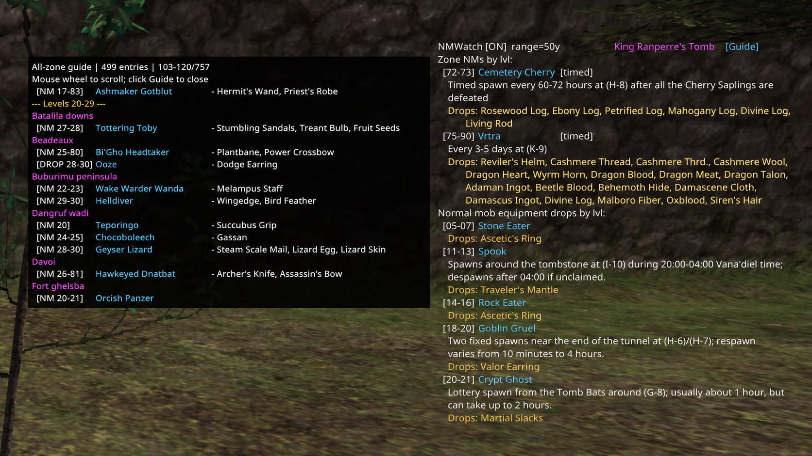

# NMWatch

Windower 4 addon that alerts when a known Notorious Monster is nearby and
provides a level-sorted guide to NMs and notable normal-monster drops across
every bundled zone. It does not send `/check` packets. Exact TargetInfo hex IDs
are checked first; the bundled NM name/zone list is used as a fallback.

## Quick start

```text
//lua load NMWatch
//nmw on
```

## HUD example



The all-zone guide is shown on the left; the live current-zone HUD remains on
the right with spawn conditions and documented drops.

Target an NM and save its exact zone-local ID:

```text
//nmw add
```

The selected mob's TargetInfo hex ID and full ID are visible in the HUD. Saved
IDs persist in `data/settings.xml` and are scoped by zone. `//nmw remove`
removes the currently targeted ID; `//nmw list` prints the saved IDs for the
current zone.

## Matching

1. Exact current-zone + TargetInfo hex ID from `//nmw add`.
2. Exact bundled wiki current-zone + TargetInfo hex ID.
3. Exact mob name in the current zone from `wiki_nms.lua`, when the wiki
   fallback is enabled.

The bundled name list covers the known NM names and zones. Exact IDs come from
explicitly labeled NM IDs in the linked article text and BG Wiki NM page notes. A mob may legitimately have multiple IDs: for
example, Leaping Lizzy uses `0x17C` and `0x190` in South Gustaberg, and NMWatch
includes both. Use `//nmw wiki` to disable or enable the name fallback.

The addon scans only active, targetable monsters within the configured radius.
It alerts for bundled NMs, placeholders, and ordinary monsters with notable
equipment drops. An entity can alert again after it disappears or dies. To
avoid sound/chat spam from groups of identical ordinary monsters, only the first
new instance of each drop-mob name is announced per scan. The nearest instances
appear in `Nearby`, up to the configured HUD limit, and can be clicked
individually.

Optional auto-select targets the closest detected match within the configured
range. If a closer match appears, it switches once to that mob; otherwise it
does not repeatedly override manual targeting. Use `//nmw autoselect on` or
`//nmw autoselect off`. Auto-select is disabled by default.

The HUD always lists the bundled NMs for the current zone, labels each as
`timed`, `lottery`, `forced/quest`, `fished`, or `special`, and displays the
wiki's detailed spawn instruction. This includes placeholders, coordinates,
maps, timers, trade items, weather, and event conditions when documented.
Nearby matches appear above the zone list. Nearby rows include distance,
compass direction, and world X/Y/Z coordinates. Selected known NMs and
placeholders are highlighted separately from unrelated targets. Left-click a
Nearby row to target that exact mob, including when several mobs share a name.

## Widescan placeholders

NMWatch also captures native widescan results without replacing nearby mob
scanning. Use `//nmw ws` to print the captured entries in a copyable form, or
`//nmw wsclear` or right-click anywhere in the Widescan HUD section to clear
them. Duplicate names are numbered in widescan order.

NMWatch also records the widescan index of each likely placeholder. Consecutive
scans of the same living candidate add sightings but not encounters. A new ID,
a later zone visit, or a candidate seen again after death starts a new
encounter. When NMWatch observes the candidate die nearby, it records whether
the NM or another placeholder appears next within 15 minutes.

Compact encounter counts appear on placeholder rows, for example
`Fungus Beetle PH [0x0D2] | 99.8y NW | seen 6x`. Use `//nmw phstats` for the current zone or
`//nmw phstats Fungus Beetle` for detailed sightings, kills, and outcomes.
Observations are stored locally in `data/placeholder_observations.xml` and are
not committed to the repository. Use `//nmw phreset <NM name>` to clear one
current-zone record or `//nmw phreset all` to clear every observation.

For documented ordered placeholder groups, NMWatch marks the likely
placeholder and starts native widescan tracking. Tracking first follows the
placeholder, then switches to the NM if the NM itself appears in widescan, so
the target can still be followed beyond the normal 50-yalm nearby range.
Tracked entries show distance, compass direction, and world X/Y/Z when the
game returns tracking coordinates. Captured results remain until a new nonempty
widescan replaces them, the player changes zones, or `//nmw wsclear` is used.

Each zone NM displays its level range and a `Drops:` section populated from the BG Wiki
Treasure field. Entries without a usable Treasure field say
`None documented on BG Wiki.` rather than guessing.

Click `[Guide]` beside the current zone name to open the all-zone guide. It
groups every bundled NM and notable normal-monster equipment drop by level band
and zone. Level headings are gold, zone headings are magenta, and mob names use
the same cyan BG Wiki links as the main HUD. Hover the guide and use the mouse
wheel to scroll; click `[Guide]` again to close it. The window automatically
opens on the side of the HUD with enough screen space. Long drop lists are
shortened to keep the window compact.

Zones with notable equipment from ordinary monsters also display a
separate `Normal mob equipment drops` section with the monster level range,
name, documented special spawn conditions, and notable equipment. Mob names are
clickable when wiki links are enabled. Nearby matches are labeled `[drop]` and
use a distinct `DROP MOB FOUND` alert.
Each NM row shows `Last seen` and distance to the last known spot when the
mob was detected within the previous 24 hours. Older or missing sightings are
hidden.

HUD colors are used as follows:

- Magenta: current zone name.
- Cyan: clickable NM names when BG Wiki links are enabled.
- Gold: documented drops.
- Green/red circles: active/inactive Records of Eminence objectives.

The panel uses a translucent background. A newly detected NM, placeholder, or
drop mob's nearby line is shown in red with its location/index and distance; the
red alert text clears when the matching mob disappears.

NMs with a matching Records of Eminence kill objective have a colored circle:

- Green: the objective is currently active.
- Red: the objective exists but is not currently active.
- No circle: NMWatch has no matching kill objective for that NM.

Objective state is read from the live RoE objective packet; NMWatch does not
start or cancel objectives.

## Commands

| Command | Purpose |
|---|---|
| `//nmw on`, `off`, `toggle` | Control scanning |
| `//nmw add` | Save the targeted zone/index as an exact NM ID |
| `//nmw remove` | Remove the targeted zone/index |
| `//nmw list` | List exact IDs saved for this zone |
| `//nmw range <yalms>` | Change the scan radius |
| `//nmw wiki` | Toggle the bundled name fallback |
| `//nmw links [on\|off]` | Enable or disable clickable BG Wiki NM names |
| `//nmw autoselect [on\|off]` | Automatically target the closest detected match |
| `//nmw hud` | Toggle the HUD |
| `//nmw pos [x y]` | Show or set the HUD position; negative coordinates are allowed |
| `//nmw alpha <0-255>` | Set HUD background opacity (`0` transparent, `255` solid) |
| `//nmw sound` | Toggle sound |
| `//nmw soundfile <path>` | Set the alert `.wav` |
| `//nmw clear` | Clear current detection history, not saved IDs |
| `//nmw test [name]` | Test the chat/HUD/sound alert |
| `//nmw ws` / `//nmw widescan` | Print captured widescan entries |
| `//nmw wsclear` | Clear captured widescan entries |
| `//nmw phstats [NM name]` | Show candidate-ID evidence for the current zone |
| `//nmw phreset <NM name\|all>` | Clear recorded candidate-ID evidence |
| `//nmw status` | Show current settings |

## Data source

`wiki_nms.lua` contains the bundled name fallback: 435 unique
NM names across 447 zone/name combinations. Multi-zone entries are expanded so
each applicable zone can match independently.

Exact IDs are sourced from the corresponding BG Wiki page notes, for example:

<https://www.bg-wiki.com/ffxi/Leaping_Lizzy>

The wiki data can be replaced later with a cleaner list without changing the
scanner. Its `ids` table is keyed by numeric zone ID and TargetInfo hex index;
its `names` table is keyed by lowercase English zone name.
`spawn_types.lua` contains one documented pop-method annotation for every NM in
the bundled list. These annotations are display information only; detection
still uses the exact-ID and name rules above.
`spawn_details.lua` contains zone-specific instructions for all 447 zone/name
combinations. Zone-specific keys prevent shared NMs such as Goblin Archaeologist
from displaying the wrong coordinates.
`drops.lua` contains BG Wiki's documented Treasure drops for the same 447
zone/name combinations. The HUD shows `None documented on BG Wiki.` when the
page has no usable Treasure entry.
`normal_drops.lua` contains zone-specific ordinary-monster equipment drops from
the [FFXIclopedia community guide](https://ffxiclopedia.fandom.com/wiki/Uncraftable_equipment_drops_from_normal_monsters).
Regional rows are expanded to each applicable present-day zone.
`roe_nms.lua` maps the 82 bundled NMs with known Records of Eminence kill
objectives to their objective IDs.

With wiki links enabled (the default), left-click an NM name in the HUD to open
its BG Wiki page. Drag the HUD by either header line. Steam Deck users can run
`//nmw links off` to prevent NMWatch from launching an external browser.
